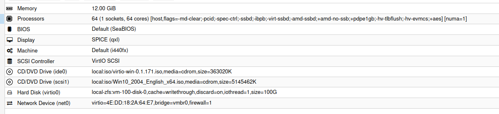

# Windows 10 (VM) Setup

https://davejansen.com/recommended-settings-windows-10-2016-2018-2019-vm-proxmox/

## Drivers



Win10 Disk needs to be SCSI

Virtio driver Disk from RedHat

[Spice Agent and Drivers](https://www.spice-space.org/download.html)

**TODO** Launch ballooning ...

## MetaTrader 5

Setup MetaTester agents for all (64) cores

## MEGA

https://mega.nz/sync

## Samba

Enable Network Share for Metrtrader5 Terminal dir.

## Other stuff

disable sleep otherwise the VM will go to sleep after 30min :P

# Benchmarking Win 10 VM disk performance

https://bsdio.com/fio/

```sh
fio.exe --time_based --name=benchmark --size=5000M --runtime=30 --ioengine=windowsaio --numjobs=8 --iodepth=8 --rw=randwrite --blocksize=4k --group_reporting --direct=1
```
