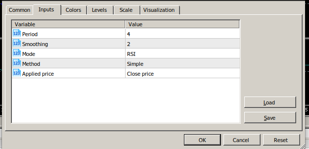

# Documentation for backtestd

## MEGA.nz syncing

### Download MEGASync

### Setup Syncs

|Local Folder | MEGA Folder | Purpose |
| -- | -- | -- |
| `/home/stefan/work/nnfx/reports` | `/nnfx/reports/{Stefan}` | Test Run results | 
| `/home/stefan/.wine/drive_c/Program Files/MetaTrader 5/MQL5/Indicators` | `/nnfx/Indicators`| MT5 Indicators |

## Indicator Definitions

The Indicators descriptions are defined with yaml config files in the config directory.
`/nnfx/config/indicator/{function}/{indicator}.yaml`

The *function* of the indicator referres to it's function within the algorithm. Like *confirmation*, *exit*, *baseline*, ...

Example config for *ASH*:

``` yaml
name: ash
filename: ASH
class: ZeroLineCross
inputs:
    - - 9.0
      - 4.0
      - 20.0
      - 1.0
    - - 2.0
      - 0.0
      - 10.0
      - 1.0
    - - 0.0
      - 0.0
      - 1.0
      - 1.0
    - - 0.0
      - 0.0
      - 3.0
      - 1.0
    - - 0.0
      - 0.0
      - 6.0
      - 1.0
buffers:
  - 0
shift: 0
```

| option | description |
| -- | -- |
| **name** | The Name of the indicator. This is used in the data processing later |
| **filename** | The filename of the indicator as seen in MT5 |
| **class** | The indicator class as described below. |
| **inputs** | The indicator input parameters in the order they appear in MT5 |
| **buffers** | The index / indices of the internal buffers (lines) to use for the signal. |
| **params** | Additional parameters (params) depending on the class. |
| **shift** | How many candles the signal should be shifted |

### Indicator Classes

| class | buffers | params | Description |
| --    | ------- | ------ | ----------- |
| Preset | - | - | The functionality is defined in the code |
| ZeroLineCross | [line] | - | Single line crossing 0 |
| TwoLinesCross | [up, down] | - | Two lines crossing |
| ColorChange | [line] | color values: [neutral, up, down] | Single line changing color |
| Semaphore | [line] | - | Signal signs like arrows on the chart |
| LevelCross | [line] | [level] | A Line crossing a levels |
| TwoLevelsCross | [line] | [up enter, up exit, down enter, down exit] | A Line crossing a two levels |
| Saturation | [line] | [up enter, up exit, down enter, down exit] | A line the enters a saturation (overbought/ oversold) region |

**TODO** not complete list -> write a more detailed description of each of the classes

### Inputs

Each indicator has a number of input parameters



These Inputs are defined in the source of the indicator

``` c++
input uint                 InpPeriod         =  9;             // Period
input uint                 InpPeriodSm       =  2;             // Smoothing
input ENUM_MODE            InpMode           =  MODE_RSI;      // Mode
input ENUM_MA_METHOD       InpMethod         =  MODE_SMA;      // Method
input ENUM_APPLIED_PRICE   InpAppliedPrice   =  PRICE_CLOSE;   // Applied price
```

In the yaml file the inputs are structured as follows and in this case define the `InpPeriod` from ASH with default value of 9. For the optimization process values starting at 4 until 20 are considered with a stepping of 1.

``` yaml
    - - 9.0    # default value
      - 4.0    # start value
      - 20.0   # end value
      - 1.0    # step
```

The indicators are structured as a 2D array `[[], [], ..]`
The first `-` indicates the index in the outer array, and the 4x `-` define the value and ranges of the input.


In order to get the inputs into the yaml file I usually copy the inputs from the mq5 file, comment them out in the yaml file and add the inputs definition in between.

#### Enumerations

Enum types can be used as integer values. For example `ENUM_APPLIED_PRICE` has possible values 0 - 6.

| typical enum | values |
|--|--|
| [ENUM_TIMEFRAMES](https://www.mql5.com/en/docs/constants/chartconstants/enum_timeframes) | 0 - 21 (Typically 0 = *CURRENT*) |
| [ENUM_APPLIED_PRICE](https://www.mql5.com/en/docs/constants/indicatorconstants/prices) | 0 - 6 |
| [ENUM_MA_METHOD](https://www.mql5.com/en/docs/constants/indicatorconstants/enum_ma_method) | 0 - 6 |

Other enums like `ENUM_MODE` are typically defined in the code

### Buffers

The buffers refer to the index or indices of the internal buffer of the indicator.
For example ash has 7 internal buffers which is uses to for temporary values.

``` c++
SetIndexBuffer(0,BufferASH,INDICATOR_DATA);                  // <-- we are interested in this value 
SetIndexBuffer(1,BufferColors,INDICATOR_COLOR_INDEX);
SetIndexBuffer(2,BufferBL,INDICATOR_CALCULATIONS);
SetIndexBuffer(3,BufferBR,INDICATOR_CALCULATIONS);
SetIndexBuffer(4,BufferAvgBL,INDICATOR_CALCULATIONS);
SetIndexBuffer(5,BufferAvgBR,INDICATOR_CALCULATIONS);
SetIndexBuffer(6,BufferAvgSmBL,INDICATOR_CALCULATIONS);
SetIndexBuffer(7,BufferAvgSmBR,INDICATOR_CALCULATIONS);
SetIndexBuffer(8,BufferMA,INDICATOR_CALCULATIONS);
```

In this case index 0 is the value that is drawn to the chart and is the value we are interested in.
In the buffers section in the yaml file 0 is inserted.

For indicators of the TwoLinesCross class two buffers need to be inserted.
For example the Ultra Trend indicator (ut) uses buffers 2 and 4 for the up and the down line.

``` yaml
buffers:
  - 2
  - 4
```

This needs to be figured out by looking at the code and trying a visual test run to verify the configuration.

### Params 

The params are defined according to the indicator class.
